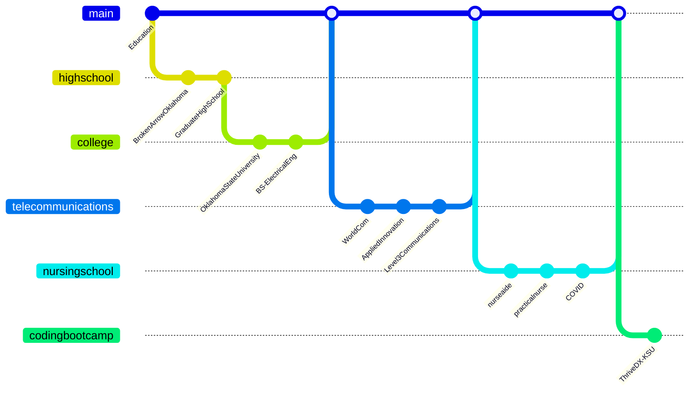

Hi 👋 My name is Scott Green
============================

* 🌍  I'm based in United States
* ✉️  You can contact me at [sagreenxyz@gmail.com](mailto:sagreenxyz@gmail.com).
* ⚡  I finished the Thrive-DX (Hacker-U) / Kansas State University Software Development Bootcamp on July 23rd, 2022.
* ⚡  I am currently working on many Zero-to-Mastery programs related to JavaScript, the MERN/PERN stacks, and Python.

# Education/Experience

BTW, I'm Certified Lit 🔥🔥.  Ask for my credentials and references...
